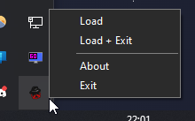

# Fedoraloader v2

Fedoraloader is an easy-to-use loader for the free and open-source cheat [Fedoraware](https://github.com/Fedoraware/Fedoraware).
It automatically downloads and injects the latest Fedoraware build into your game.
Optionally, Fedoraloader can also restart Steam and inject a VAC-Bypass to prevent bans.

This is a complete rewrite in C++ 20 of Fedoraloader in an attempt to fix previous issue and make the injection process as streamlined as possible.
The previous version was written in C# and can be found [here](https://github.com/Fedoraware/Fedoraloader-Legacy).

> [!NOTE]  
> VAC-Bypass is disabled by default to prevent issues with other game.
> Check the options section below to enable it.

## Usage

- Run Fedoraloader as administrator
- Right click on the tray icon to open the menu
- Click **Load** or **Load + Exit**

## FAQ

### How do I fix "MSVCP140.dll not found"?

Download and install the [Microsoft Visual C++ Redistributable](https://aka.ms/vs/17/release/vc_redist.x86.exe).

### Do I need to update the loader?

No, the loader will automatically download the latest Fedoraware build every time.
You only need to re-download the loader if a significant change has been made to it.

### Why did Fedoraloader disappear?

You need to add the loader file to your antivirus' exception list or disable it completely.
This is a false positive due to the nature of injectors and their similarity to malware.

### Where does it download the file from?

We're using [nightly.link](https://nightly.link/) to retrieve the latest [GitHub artifact](https://github.com/Fedoraware/Fedoraware/actions).
This service allows us to download the file without requiring a GitHub account.

## Options

Fedoraloader allows some options to be set via command line arguments.
To use them, create a shortcut to the loader and add the arguments to the target field.

| Argument | Description |
| --- | --- |
| `-silent` | Run the loader without GUI |
| `-usebypass` | Restart Steam with VAC bypass |
| `-debug` | Use LoadLibrary-Injection (only works with local files) |
| `-file "..."` | Custom local file (.zip or .dll) |
| `-url "..."` | Custom download URL (.zip or .dll) |

## Credits

- [miniz](https://github.com/richgel999/miniz)
- [VAC Bypass](https://github.com/danielkrupinski/VAC-Bypass)
- [Simple Manual Map Injector](https://github.com/TheCruZ/Simple-Manual-Map-Injector)
