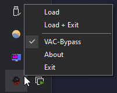

# Fedoraloader

Fedoraloader is an easy-to-use loader for the free and open-source cheat [Fedoraware](https://github.com/Fedoraware/Fedoraware).
It automatically download and injects the latest Fedoraware build into your game.

This is a complete C++ rewrite of the old Fedoraloader, which was written in C#.

## Usage

- Run Fedoraloader as administrator
- Right click on the tray icon to open the menu
- Click **Load** or **Load + Exit**

## FAQ

### How do I fix "MSVCP140. dll not installed"?

Download and install the [Microsoft Visual C++ Redistributable for Visual Studio 2015, 2017 and 2019](https://aka.ms/vs/17/release/vc_redist.x86.exe).

### Do I need to update the loader?

No, the loader will automatically download the latest Fedoraware build.
You only need to re-download the loader if a significant change was made to it.

### Why did the file disappear?

You need to add the loader file to your antivirus' exception list or disable it completely.
This is a false positive due to the nature of injectors and their similarity to malware.

### Where does it download the file from?

We're using [nightly.link](https://nightly.link/) to retrieve the latest [GitHub artifact](https://github.com/Fedoraware/Fedoraware/actions).
This service allows us to download the file without requiring a GitHub account.

## Options

Fedoraloader allows some options to be set via command line arguments.
To use them, create a shortcut to the loader and add the arguments to the target field.

| Argument | Description |
| --- | --- |
| `-silent` | Runs the loader without GUI |
| `-unprotected` | Skips VAC-Bypass and doesn't restart Steam |
| `-debug` | Uses LoadLibrary-Injection (only works with local files) |
| `-file "..."` | Use custom local file (.zip or .dll) |
| `-url "..."` | Custom download URL (.zip or .dll) |

## Credits

- [miniz](https://github.com/richgel999/miniz)
- [VAC Bypass](https://github.com/danielkrupinski/VAC-Bypass)
- [Simple Manual Map Injector](https://github.com/TheCruZ/Simple-Manual-Map-Injector)
